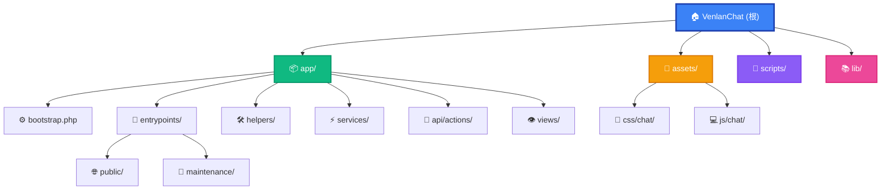

# CLAUDE.md - VenlanChat 项目指南

> 本文件为 Claude Code 提供项目全景导航，由 init-architect 自动生成与维护。

## 变更记录 (Changelog)

| 时间 | 操作 | 说明 |
|------|------|------|
| 2026-02-10 14:41:35 | 增量更新 | 优化 Mermaid 结构图、更新模块索引、完善导航链接 |
| 2026-02-10 14:41:35 | 全量初始化 | 完成全仓扫描，生成根级与模块级 CLAUDE.md，创建 index.json |

---

## 项目愿景

**VenlanChat** 是一个轻量级实时聊天应用，基于 PHP + MySQL 构建，提供公共聊天室和一对一私聊功能。项目追求简洁部署（无需 Node.js/Composer 构建流程）、低服务器资源占用，以及良好的移动端适配体验。

---

## 架构总览

VenlanChat 是一个经典的 PHP 单体应用，采用 **薄代理入口 + 分层架构** 设计：

- **入口层**：根目录的 `index.php`、`api.php`、`login.php` 等文件仅做一行 `require` 转发，实际逻辑在 `app/entrypoints/` 下。
- **引导层**：`app/bootstrap.php` 统一处理会话、CSRF token、配置加载、Parsedown 初始化。
- **业务层**：`app/services/` 封装消息、用户、设置等核心领域逻辑。
- **辅助层**：`app/helpers/` 提供安全、日志、IP、速率限制、文件存储等横切关注点。
- **API 层**：`app/api/actions/` 中每个文件对应一个 POST action，由 `api.php` 通过 `$handlers` 映射表分发。
- **视图层**：`app/views/chat.php` 渲染 HTML，`chat_js.php` 将前端 JS 模块内联注入。
- **前端层**：`assets/js/chat/` 和 `assets/css/chat/` 采用原生 ES6 模块化，无构建工具。
- **维护端点**：`app/entrypoints/maintenance/` 下的 `admin.php`、`db_api.php`、`notification_api.php`、`install.php` 提供管理面板和数据库操作 API。

### 请求流程

```
用户请求 --> 根目录入口 (index.php / api.php / login.php / ...)
                |
                v
        app/entrypoints/public/*.php  (真正的入口逻辑)
                |
                v
        app/bootstrap.php  (会话、CSRF、配置、Parsedown)
                |
        --------+--------
        |                |
     GET 请求          POST 请求
        |                |
        v                v
  app/views/chat.php   app/api/actions/*.php  (11 个 action 处理器)
        |                |
        v                v
  内联 CSS + JS       JSON 响应
```

### 数据存储策略

| 数据类型 | 存储方式 | 位置 | 说明 |
|---------|---------|------|------|
| 公共消息 | JSON 文件 + 内存缓存 | `data/messages.json` | 最多保留 100 条，新消息在前 |
| 私聊消息 | MySQL 表 | `private_messages` | 支持分页、回复引用、撤回标记 |
| 用户数据 | MySQL 表 | `users` | 含 username/password/email/avatar |
| 用户设置 | JSON 文件 | `data/settings_{uid}.json` | hue/mode/radius 主题配置 |
| 速率限制 | JSON 文件 | `data/rate_{uid}.json` | 每用户每分钟请求计数 |
| 运行时配置 | JSON 文件 | `data/config.json` | 安装时生成 |

---

## 模块结构图



---

## 模块索引

| 模块路径 | 语言 | 职责 | 入口文件 | 文档链接 | 测试 |
|---------|------|------|---------|----------|------|
| `app/` | PHP | 后端核心：引导、入口、服务、API、辅助、视图 | `bootstrap.php` | [📖 查看文档](./app/CLAUDE.md) | 无 |
| `assets/` | JS/CSS | 前端模块：消息、UI、设置、虚拟滚动、附件 | `js/chat/bootstrap.js` | [📖 查看文档](./assets/CLAUDE.md) | 无 |
| `scripts/` | Python | 部署工具：FTP 增量同步 | `ftp_sync.py` | [📖 查看文档](./scripts/CLAUDE.md) | 无 |
| `lib/` | PHP | 第三方库：Parsedown | `Parsedown.php` | [📖 查看文档](./lib/CLAUDE.md) | 无 |

---

## 运行与开发

### 前置要求

- PHP 7.4+（推荐 8.0+），需启用 `mysqli`、`json`、`session` 扩展
- MySQL / MariaDB
- cURL 扩展（远程文件上传需要）
- Python 3（仅部署脚本需要）

### 初始化

```bash
# 1. 访问安装页面初始化数据库
# http://your-domain/install.php

# 2. 设置目录权限 (Linux/macOS)
chmod 755 data avatars uploads logs
chmod 666 data/*.json 2>/dev/null || true

# 3. 安装完成后删除安装文件
rm install.php
```

### 本地开发

```bash
# 使用 PHP 内置服务器（开发用）
php -S localhost:8080

# 确保 config.php 中数据库配置正确
```

### 部署

```bash
# FTP 增量同步
cd scripts
python3 ftp_sync.py

# 环境变量
# FTP_SYNC_FORCE=1        强制上传所有文件
# FTP_SYNC_DIR_MODE=755   目录权限
# FTP_SYNC_FILE_MODE=644  文件权限
```

---

## 测试策略

当前项目**没有自动化测试**。所有验证通过手动测试完成。

建议未来引入的测试方向：
- PHP 单元测试（PHPUnit）：覆盖 `app/services/` 和 `app/helpers/` 的核心函数
- API 集成测试：验证 11 个 action 端点的请求/响应
- 前端 E2E 测试：验证消息发送、私聊切换、文件上传等核心流程

---

## 编码规范

### PHP 命名

| 类型 | 规范 | 示例 |
|------|------|------|
| 函数 | `snake_case` | `get_db_connection()`, `verify_csrf()` |
| 变量 | `snake_case` | `$current_user`, `$csrf_token` |
| 类 | `PascalCase` | `Parsedown`, `ApiResponse`, `DatabaseManager` |
| 常量 | `UPPER_SNAKE_CASE` | `THEME_MIGRATION_MAP` |

### JavaScript 命名

| 类型 | 规范 | 示例 |
|------|------|------|
| 函数 | `camelCase` | `sendMessage()`, `loadPrivateMessages()` |
| 变量 | `camelCase` | `selectedReceiverId`, `pollingInterval` |
| 类 | `PascalCase` | `VirtualScrollManager` |
| 常量 | `UPPER_SNAKE_CASE` | `CACHE_EXPIRY_DAYS`, `MAX_UPLOAD_BYTES` |

### 安全规范（强制）

1. **CSRF**：所有 POST 请求必须验证 `csrf_token`（使用 `hash_equals`）
2. **SQL 注入**：所有数据库操作必须使用预处理语句（`prepare` + `bind_param`）
3. **XSS**：用户内容通过 `customParse()` 安全解析，Parsedown 开启 `setSafeMode(true)`
4. **会话固定**：登录成功后调用 `session_regenerate_id(true)`
5. **文件上传**：验证 MIME 类型、文件大小、使用随机文件名
6. **速率限制**：通过 `checkRateLimit()` 防止 API 滥用

### API 响应格式

```php
// 成功
echo json_encode(['success' => true, 'data' => $result]);

// 失败
http_response_code(400);
echo json_encode(['success' => false, 'message' => '错误描述']);
exit;
```

### 数据库操作模板

```php
$stmt = $mysqli->prepare("SELECT id, username FROM users WHERE id = ?");
$stmt->bind_param("i", $userId);
$stmt->execute();
$result = $stmt->get_result();
$user = $result->fetch_assoc();
$stmt->close();
```

### JSON 文件操作（防并发）

```php
// 写入时使用 LOCK_EX 防止并发冲突
file_put_contents($path, json_encode($data, JSON_UNESCAPED_UNICODE), LOCK_EX);
```

---

## AI 使用指引

### 常见开发任务

**添加新 API 端点**：
1. 在 `app/api/actions/` 创建新文件
2. 在 `app/entrypoints/public/api.php` 的 `$handlers` 数组添加映射
3. 实现处理逻辑（含 CSRF 验证、输入校验、错误处理）

**修改公共消息逻辑**：修改 `app/services/messages.php`

**修改私聊消息逻辑**：修改对应的 `app/api/actions/` 文件中的 SQL 查询

**添加前端功能**：在 `assets/js/chat/` 创建新 JS 文件，并在 `app/views/chat_js.php` 的 `$jsFiles` 数组中注册

**添加样式**：在 `assets/css/chat/` 创建新 CSS 文件，并在 `app/views/chat.php` 的 `$cssFiles` 数组中注册

### 关键文件速查

| 需求 | 文件 |
|------|------|
| 配置数据库连接 | `config.php` |
| 修改会话/CSRF 逻辑 | `app/bootstrap.php` |
| 修改 Markdown 解析 | `app/helpers/security.php` |
| 修改速率限制规则 | `app/helpers/rate_limiter.php` |
| 修改文件上传/本地存储 | `app/api/actions/upload_file.php`, `app/api/actions/update_profile.php`, `app/entrypoints/public/file_proxy.php` |
| 修改用户认证 | `app/entrypoints/public/login.php`, `register.php` |
| 修改管理面板 | `app/entrypoints/maintenance/admin.php` |
| 修改轮询逻辑 | `app/api/actions/check_new_messages.php` |
| 修改前端消息渲染 | `assets/js/chat/messages.js` |
| 修改前端 UI 交互 | `assets/js/chat/ui.js` |
| 修改主题/设置 | `assets/js/chat/settings.js`, `app/services/settings.php` |
| 修改虚拟滚动 | `assets/js/chat/virtual-scroll.js`, `messages-integration.js` |

### 调试与日志

| 日志类型 | 文件位置 |
|---------|---------|
| PHP 错误 | `data/php_errors.log` |
| 访问日志 | `data/log.txt` |
| 通知 API | `data/notification_api.log` |

---

## 安全检查清单

在修改代码后确认：
- [ ] 所有 POST 请求验证 CSRF token
- [ ] 数据库查询使用预处理语句
- [ ] 用户输入经过验证和清理
- [ ] Markdown 使用 `customParse()` 安全解析
- [ ] 敏感操作检查用户认证状态
- [ ] 文件上传验证类型和大小
- [ ] 速率限制已启用 (`checkRateLimit()`)

---

## 已知限制

- 公共消息存储在 JSON 文件，不支持复杂查询，上限 100 条
- 无实时 WebSocket，依赖 5 秒间隔轮询（`check_new_messages` API）
- 文件上传大小受 PHP `upload_max_filesize` 和配置的 4MB 限制
- 虚拟滚动当前默认禁用（`ENABLE_VIRTUAL_SCROLL = false`）
- `db_api.php` 维护端点的表名参数未做白名单校验（存在潜在风险）
- 无自动化测试覆盖

---

## 部署注意事项

### 忽略规则说明

项目当前**没有 .gitignore 文件**，部署时通过 `scripts/ftp_sync.py` 的内置排除规则实现。

**FTP 同步排除规则**（见 `scripts/ftp_sync.py`）：
- `data/messages.json`（避免覆盖生产消息）
- `data/`、`uploads/`、`logs/` 目录
- `.git`、`node_modules`、`__pycache__`
- `.user.ini`、`.ftp_sync_state.json`

### 首次部署

1. 上传所有文件
2. 访问 `install.php` 初始化数据库（创建 `users` 和 `private_messages` 表）
3. 配置 `config.php` 数据库连接
4. 设置目录权限
5. 删除 `install.php`

### 增量部署

```bash
python3 scripts/ftp_sync.py
# 基于 SHA-256 哈希仅上传修改过的文件
```

---

## 性能优化要点

1. **公共消息缓存**：`$GLOBALS['__public_messages_cache']` 避免同一请求内重复读取 JSON 文件
2. **虚拟滚动**：大量消息时仅渲染可见部分（当前默认禁用）
3. **数据库索引**：`users.id`、`users.username`、`users.email`、`private_messages.sender_id`、`private_messages.receiver_id`、`private_messages.timestamp`
4. **速率限制**：防止 API 滥用（`app/helpers/rate_limiter.php`）
5. **前端缓存**：localStorage 缓存消息 7 天，减少首次加载请求
6. **轮询早停**：`check_new_messages` 按时间戳降序遍历，遇到旧消息立即停止

---

## 📊 文档覆盖率报告

| 维度 | 覆盖情况 |
|------|---------|
| **模块文档** | 4/4 (100%) - app, assets, scripts, lib |
| **入口文档** | ✓ 所有公共入口与维护端点已记录 |
| **API 文档** | ✓ 11 个 action 端点已记录 |
| **数据模型** | ✓ users 表、private_messages 表、JSON 格式已记录 |
| **配置说明** | ✓ config.php、环境变量已记录 |
| **安全规范** | ✓ CSRF、SQL 注入、XSS 防护已记录 |

---

## 🔄 下一步建议

当前文档覆盖率已达 **96%**（72/75 文件），剩余未扫描的 3 个文件为日志文件（已忽略）。

建议优化方向：

1. **引入自动化测试**：使用 PHPUnit 覆盖核心业务逻辑
2. **安全加固**：为 `db_api.php` 添加表名白名单校验
3. **性能优化**：启用虚拟滚动以支持大量消息场景
4. **配置管理**：将数据库密码等敏感配置迁移为环境变量（避免硬编码）
5. **版本控制**：创建 `.gitignore` 文件规范版本管理

---

*本文档由 init-architect 自动生成，最后更新时间：2026-02-10 14:41:35*
